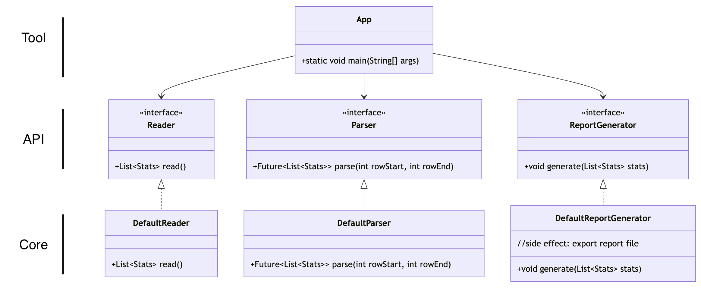

# 1brc
This project parses (min, max, average) a billion rows but really fast. 
- Row format of measurements.txt: String;Decimal\n
- https://github.com/gunnarmorling/1brc/tree/main

## Class Diagram


---

## How to use

Follow these steps to generate a large measurements file, run the parser with profiling, and review performance metrics on your machine.

### Prerequisites

- Java 21+ and on `PATH`
- Apache Maven 3.6+ installed

#### 1. Generate measurements file

This project includes a Maven profile (`generate-measurements`) to create a ~13 GB `measurements.txt` with one billion random records. The output file will be placed at:

```
src/test/resources/measurements.txt
```

Run:

```bash
# from the project root, build without running tests
mvn clean package -DskipTests

# invoke the generator via the Maven profile
mvn exec:java -Pgenerate-measurements
```

By default, the generator uses the `onebrc.tool.CreateMeasurements` main class with an argument of `1B` records resulting in a ~14GB txt file. To customize the row count, override the argument in the profile or call the `java` command directly:

```bash
# direct invocation (after packaging) with only 1M rows
java -cp target/1brc-1.0-SNAPSHOT.jar onebrc.tool.CreateMeasurements 1000000
```

#### 2. Run the parser & profiling

The default test suite invokes `DefaultParser` over the generated data and records a Java Flight Recorder (JFR) snapshot. JFR is enabled via the Surefire plugin’s `argLine`.

```bash
# execute parsing, tests, and JFR profiling
mvn test
```

#### 3. Review JFR recordings & time

After the test completes, look for JFR recordings under:

```
target/onebrc-test.jfr
```

Load the `.jfr` file in Java Mission Control (JMC) or another JFR viewer to inspect CPU hotspots, allocation rates, and I/O patterns.

Maven Surefire prints the total elapsed time for each test suite in addition to the maven tests; compare as necessary. 
