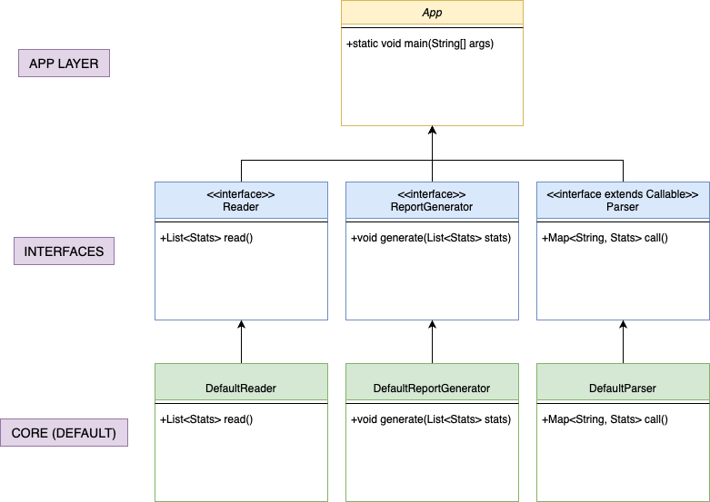

# 1brc
This project parses (min, max, average) a billion rows but really fast. 
- https://github.com/gunnarmorling/1brc/tree/main

## Class Diagram

## TODO:
- DefaultReportGenerator
- Unit tests
- How-to use this repo

